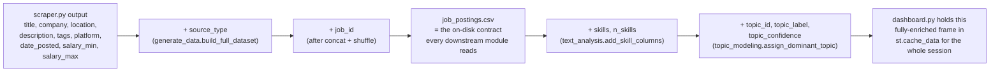
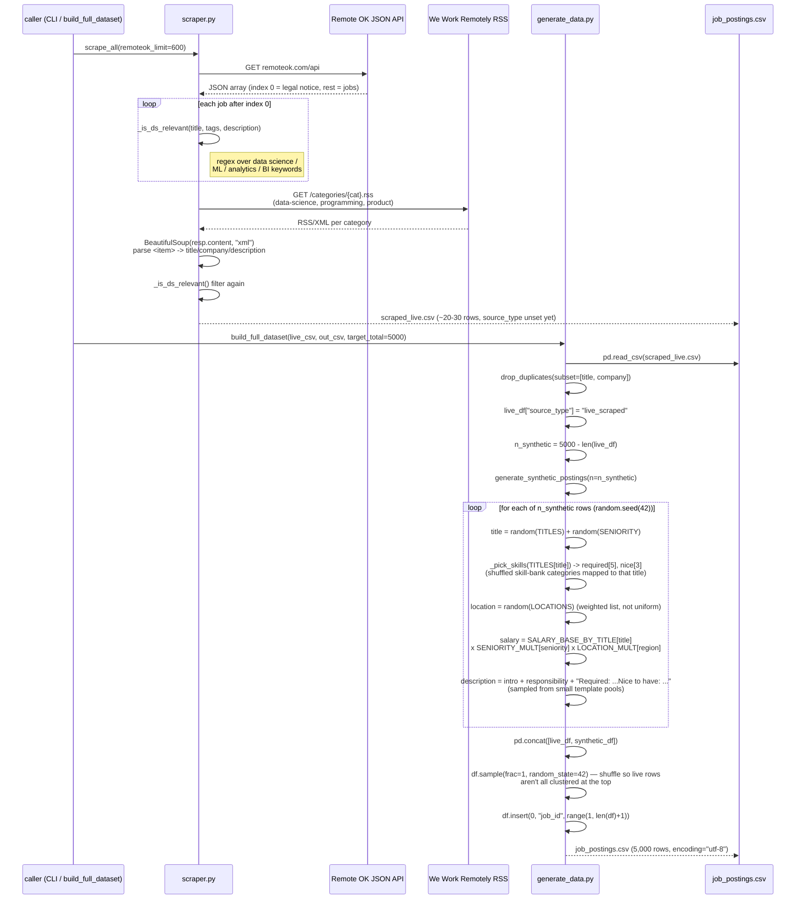
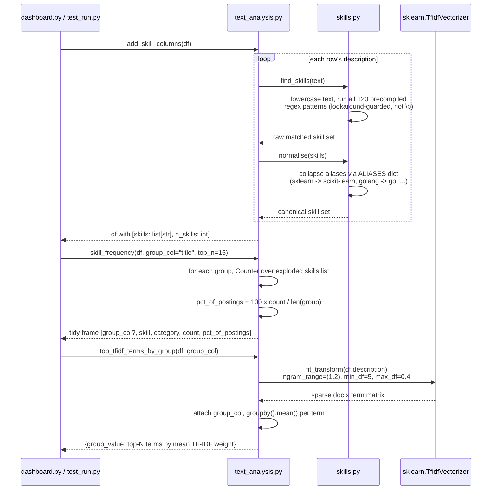
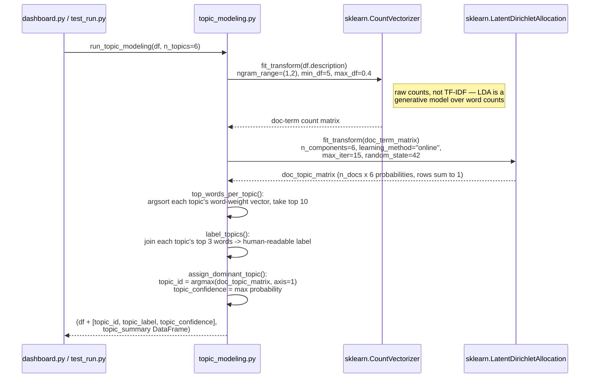
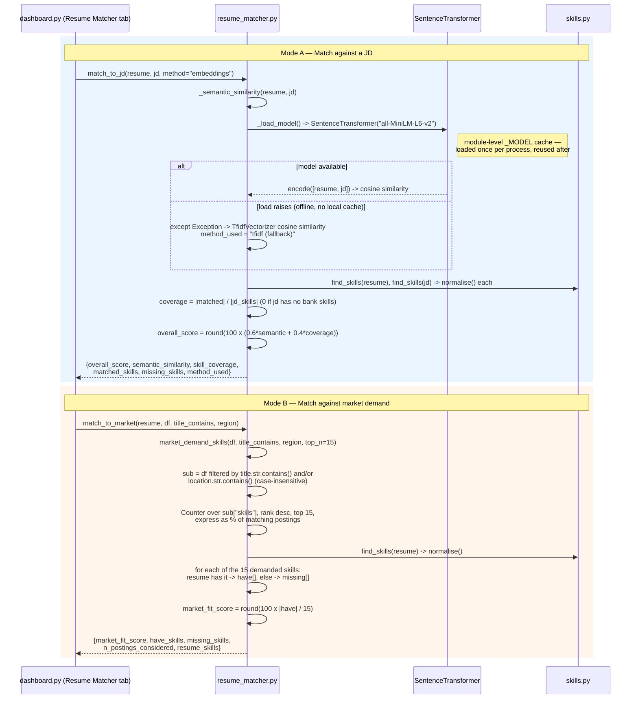
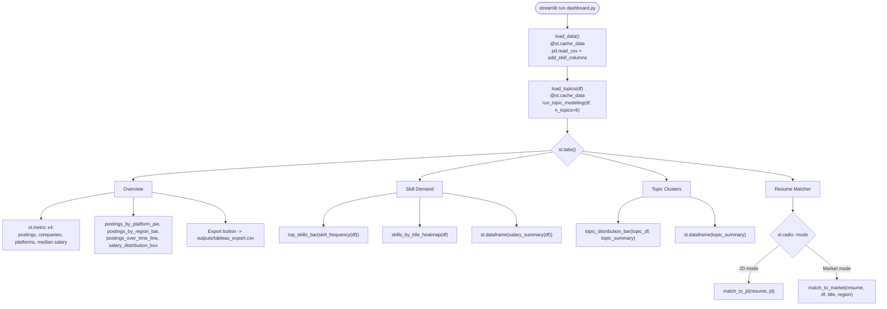

# Architecture (deep dive)

This is the engineer-facing companion to the two overview diagrams in
[README.md](README.md). Where those show *what* happens at a glance, these
show *how* — actual function call order, library calls, and how the
DataFrame's schema grows as it moves through the pipeline.

---

## 1. Data schema evolution

The same DataFrame gets columns bolted on as it passes through each stage.
This is the shape to have in your head before reading the sequence diagrams
below.

`job_postings.csv` itself never contains `skills`/`topic_*` columns — those
are computed at load time (`add_skill_columns`, `run_topic_modeling`) by
whichever script needs them, not persisted. If you're grepping the CSV for
a skill, you won't find it as a column.

---

## 2. Data collection: `python -m src.scraper` then `python -m src.generate_data`

**Why this matters if you're reading the code:** `scrape_all()` wraps each
source in its own `try/except requests.RequestException` — one source being
down (rate-limited, DNS hiccup) never blocks the other, and never blocks
`generate_data.py`, since `build_full_dataset` tolerates a missing
`scraped_live.csv` entirely (`except FileNotFoundError: live_df = pd.DataFrame()`)
and just synthesizes the full 5,000 rows.

---

## 3. Skill extraction + keyword/TF-IDF analysis

`find_skills` is a **lookup against a fixed ~120-term vocabulary**, not a
free-form extractor (no spaCy NER, no LLM call) — every skill it reports is
literally present, character-for-character (case-insensitive), in the
posting text. That's a deliberate trade-off: it can't discover a skill
outside the bank, but it can never hallucinate one either, and the
match/miss lists in the resume matcher are always independently verifiable
against the source text.

---

## 4. LDA topic modeling

`max_df=0.4` is load-bearing here, not cosmetic: without it, phrases that
appear in nearly every synthetic posting ("required skills", "nice to
have") dominate every topic and the clusters collapse into noise. Dropping
terms that appear in >40% of documents forces LDA to cluster on what
actually varies between postings.

---

## 5. Resume matcher — two call paths

Both modes share the same `0.6 semantic + 0.4 coverage` shape conceptually,
but Mode B has no semantic term at all — "market fit" is purely
skill-coverage against a *ranked, weighted* list (each skill's weight is
"% of postings asking for it"), not a binary in/out list. That's the actual
difference between "how well do I match this one JD" and "how well do I
match what the market wants" — the second one cares about *how common* each
missing skill is, not just whether it's missing.

---

## 6. Dashboard wiring

Both `load_data()` and `load_topics()` are `@st.cache_data` — on a normal
session, the CSV is read once and LDA is fit once, no matter how many times
you switch tabs or re-run widgets. The two resume-matcher calls (`M1`/`M2`)
are the only functions on this page invoked on-demand (inside `st.button`
handlers), since they're the only ones with per-user input.

---

## Related reading

- [README.md](README.md) — plain-English and high-level technical diagrams,
  the honest write-up of what's live-scraped vs. synthetic, and how to run
  everything locally.
- Each `src/*.py` module has its own docstring explaining *why* it's built
  the way it is, not just what it does — worth reading directly if you want
  more than this file covers.
