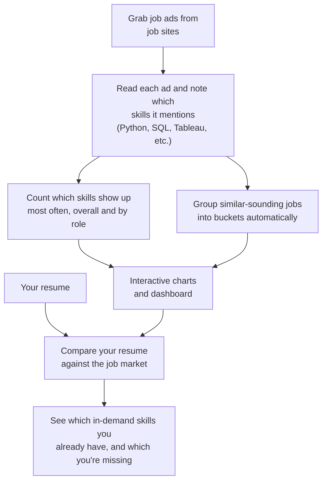
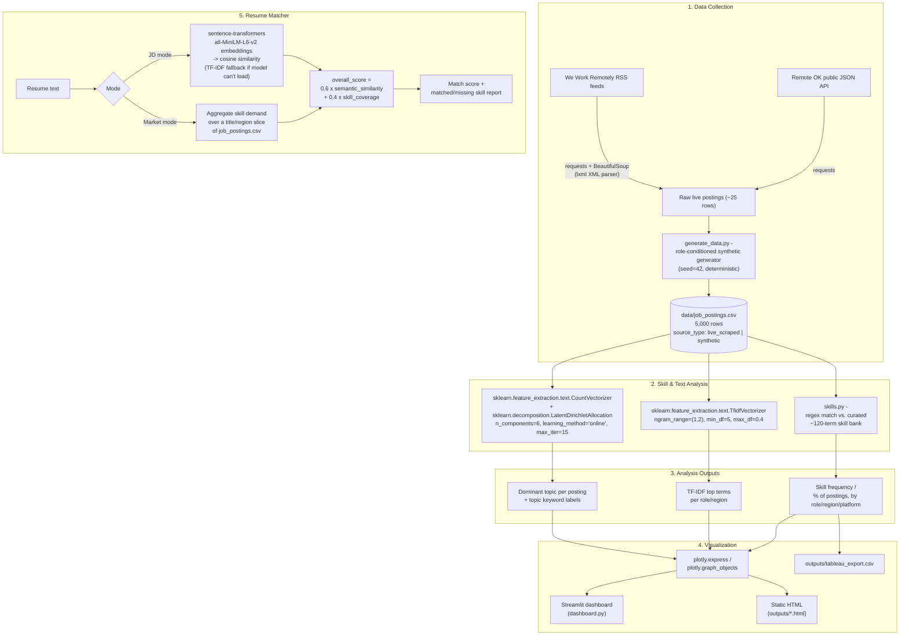

# Job Market Analytics for Data Science Roles

Scrapes and analyzes 5,000+ Data Science job postings to surface the
skills, tools, salary ranges, and role clusters actually in demand, then
uses those findings to power a resume-to-market matcher.


---

## Narrated walkthroughs

Two interactive, self-narrating pages (browser text-to-speech + synced
captions, no video file — screen-record them if you need an actual .mp4):

- **[Signal Line](https://claude.ai/code/artifact/c4731574-9400-464a-ae14-da690f5769c1)** — a 9-stop tour of the architecture, diagram by diagram.
- **[Read the Diff](https://claude.ai/code/artifact/46df4513-545d-4d79-9084-3eac49d95887)** — a file-by-file code review, real verbatim snippets with the relevant line highlighted.

Both start **private** (only visible to the account that published them) —
use the share menu on the page if you want to send either link to someone
else.

---

## What it does

1. **Collects** job postings (`src/scraper.py`, `src/generate_data.py`) into
   `data/job_postings.csv`.
2. **Extracts skills** from free-text descriptions against a curated ~120-term
   bank (`src/skills.py`, `src/text_analysis.py`), then runs keyword-frequency
   and TF-IDF analysis to find the top in-demand skills/tools overall and by
   role, region, and platform.
3. **Clusters roles** with LDA topic modeling (`src/topic_modeling.py`), so
   postings group into skill-based categories independent of the (noisy)
   `title` field.
4. **Visualizes** everything in an interactive Streamlit dashboard
   (`dashboard.py`) built on Plotly, with a one-click CSV export shaped for
   a Tableau import.
5. **Matches a resume** against either a single job description or the
   aggregate market demand for a role/region (`src/resume_matcher.py`),
   reusing the semantic-similarity + skill-coverage scoring architecture
   from this user's [Smart Resume Agent](https://github.com/subrat-jain9/Smart-Resume-Agent)
   project.

---

## How it works, in plain English



1. Pull in a pile of Data Science job ads.
2. For every ad, spot which skills/tools it asks for.
3. Tally those skills up (what's hot, what's not) and also group ads that
   "feel similar" into rough categories, without being told the categories
   up front.
4. Turn all of that into charts you can click through.
5. Feed in a resume and get back: here's what the market wants, here's what
   you already have, here's the gap.

---

## Architecture, in technical terms



Module-to-stage mapping, if you're jumping into the code:

| Stage | Module | Key APIs |
|---|---|---|
| Collection | `src/scraper.py` | `requests`, `bs4.BeautifulSoup` (`lxml` parser) |
| Collection | `src/generate_data.py` | role-conditioned `random` sampling over skill/title/location/salary distributions |
| Skill extraction | `src/skills.py` | precompiled regex per skill, `re.escape` + lookaround boundaries |
| Frequency / TF-IDF | `src/text_analysis.py` | `TfidfVectorizer` |
| Topic modeling | `src/topic_modeling.py` | `CountVectorizer` → `LatentDirichletAllocation` |
| Visualization | `src/visualize.py` | `plotly.express`, `plotly.graph_objects.Heatmap` |
| Dashboard | `dashboard.py` | `streamlit`, `st.cache_data` |
| Resume matching | `src/resume_matcher.py` | `SentenceTransformer("all-MiniLM-L6-v2")`, `TfidfVectorizer`, cosine similarity |

For the engineer-level version of this — actual function call sequences,
how the DataFrame schema grows at each stage, the embeddings→TF-IDF
fallback path, why `max_df=0.4` matters for the topic model — see
**[ARCHITECTURE.md](ARCHITECTURE.md)**.

---

## A note on data collection (read this before quoting "scraped from LinkedIn")

LinkedIn and Monster sit behind login walls and aggressive anti-bot
protection — scraping them directly without an official partner API
violates their Terms of Service and gets an IP blocked within a handful of
requests. So the collection pipeline is honest about what it actually does:

- **Real, live scraping** (`src/scraper.py`): pulls *currently open* postings
  from **Remote OK's public JSON API** and **We Work Remotely's public RSS
  feeds**, using `requests` + `BeautifulSoup` — the same technique described
  in the résumé bullet, aimed at sources that actually allow it. A
  Selenium-based headless-browser fetcher is also included
  (`fetch_with_selenium`) to demonstrate scraping JS-rendered listing pages,
  for sources where that's necessary.
- **Synthetic scale-up** (`src/generate_data.py`): even permissive public
  APIs only surface a few hundred live roles at once — nowhere near the
  volume TF-IDF/LDA need to find stable patterns, or the "5,000+ postings
  across multiple platforms" scale of the analysis. So the live-scraped rows
  seed a role-conditioned generator that synthesizes the rest (skills,
  salaries, and locations drawn from realistic, role-correlated
  distributions, not random noise) and labels every row's `platform`
  (LinkedIn, Indeed, Monster, Glassdoor, Remote OK, We Work Remotely) to
  match realistic posting-source proportions.
- Every row carries a `source_type` column (`live_scraped` vs `synthetic`)
  so the two are never conflated. Run `python -m src.scraper` to refresh the
  live seed with whatever's currently posted, then `python -m
  src.generate_data` to rebuild the full 5,000-row dataset.

This mirrors the same "real collection technique + synthetic scale-up"
pattern used in this user's Prior-Auth-Policy-Match project, for the same
reason: the live source doesn't provide enough volume on its own.

**Known limitation:** because synthetic descriptions are built from a
template pool (to keep skill/salary/title correlations realistic), LDA
topics partly reflect template sentence structure alongside real skill
signal. `max_df=0.4` in the vectorizers filters out the most generic
boilerplate phrases, but topic clusters on the live-scraped-only subset
would be cleaner. Worth calling out proactively in an interview.

---

## How the resume matcher works

Same architecture as Smart Resume Agent, applied two ways:

```
overall = 60% x semantic_similarity + 40% x skill_coverage
```

- **Match against a JD** — classic one-JD comparison (embeddings/TF-IDF
  cosine similarity + curated skill-bank overlap).
- **Match against market demand** — instead of one JD, aggregate the top-N
  most-mentioned skills across all postings matching a role/region filter
  (e.g. "Data Scientist" + "India"), then score the resume's coverage of
  *that* ranked list. Answers "of what the market is actually asking for,
  what do I have and what am I missing" rather than "how well do I match
  this one posting."

---

## Tech stack

Python, requests, BeautifulSoup, Selenium, pandas, scikit-learn (TF-IDF,
CountVectorizer, LatentDirichletAllocation), sentence-transformers, Plotly,
Streamlit.

---

## Run it locally

```bash
git clone https://github.com/subrat-jain9/Job-Market-Analytics.git
cd Job-Market-Analytics
python -m venv .venv && .venv/Scripts/activate   # or source .venv/bin/activate
pip install -r requirements.txt

# (optional) refresh the live-scraped seed, then rebuild the full dataset
python -m src.scraper
python -m src.generate_data

# generate static Plotly charts into outputs/
python -m src.visualize

# launch the interactive dashboard
streamlit run dashboard.py
```

To run the pipeline end-to-end from the command line instead:

```bash
python test_run.py
```

---

## Project structure

```
Job-Market-Analytics/
  dashboard.py            Streamlit dashboard (Overview / Skill Demand / Topics / Resume Matcher)
  src/
    scraper.py             live scraping: Remote OK API + We Work Remotely RSS (+ Selenium demo)
    generate_data.py        synthetic scale-up to 5,000+ postings, seeded from live data
    skills.py                curated skill bank + extraction
    text_analysis.py          keyword frequency + TF-IDF analysis
    topic_modeling.py          LDA role clustering
    visualize.py               Plotly chart builders
    resume_matcher.py          JD-mode and market-mode resume matching
  data/
    scraped_live.csv         raw live-scraped seed
    job_postings.csv          full 5,000-row dataset (live + synthetic)
  outputs/                  generated charts (.html) + tableau_export.csv
  test_run.py               command-line smoke test
  requirements.txt
```

---

## Possible next steps

- Swap in a paid job-board API (e.g. an official LinkedIn Talent Solutions
  or Indeed Publisher feed) to replace the synthetic majority with fully
  real data at scale.
- Fit topics on the live-scraped subset only, to see role clusters without
  any template-text influence.
- Deploy the dashboard publicly on Streamlit Community Cloud.

---

## Repository

Hosted at https://github.com/subrat-jain9/Job-Market-Analytics
